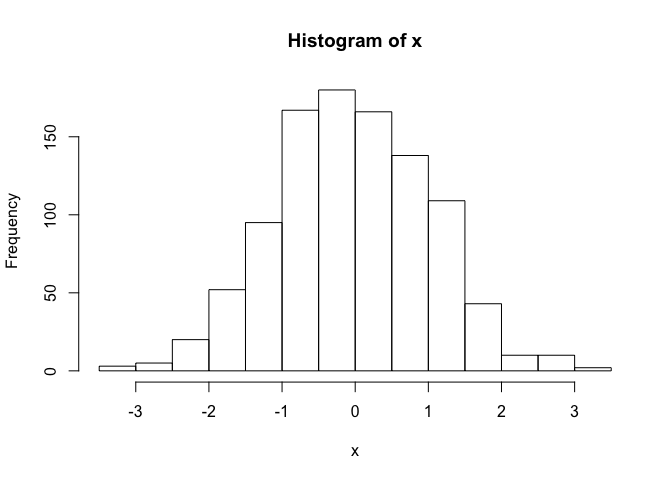

Class 05 R graphics intro
================
Jiaye Chen
Jan 22nd, 2019

This is some test and I can have **bold** and *Italic* and `code`

``` r
# My first boxplot
x <- rnorm(1000,0)
boxplot (x) 
```


``` r
summary(x)
```

    ##     Min.  1st Qu.   Median     Mean  3rd Qu.     Max. 
    ## -3.25673 -0.78541 -0.06144 -0.03320  0.71942  3.26374

``` r
hist(x)
```



``` r
boxplot(x, horizontal = TRUE)
```


``` r
# Hands on session
```

I have generate x and it has 1000

``` r
# Q1
weight <- read.table("bimm143_05_rstats/weight_chart.txt", header = TRUE)
plot(weight[,1],weight[,2], type = "b", pch = 15, cex = 1.5, lwd=2, ylim=c(2,10), xlab="Age (months)",
     ylab="Weight (kg)", main="Baby Weight With Age")
```


``` r
#Q2
GRCm38_gene <- read.table("bimm143_05_rstats/feature_counts.txt", header = TRUE, sep = "\t")
barplot(GRCm38_gene$Count)
```


``` r
par(mar = c(3.1, 11.1, 4.1, 2))
barplot(GRCm38_gene$Count, names.arg = GRCm38_gene$Feature, horiz=TRUE, ylab = "",
        main="Number of Features in the mouse GRCm38 Gene", las = 1, xlim = c(0,80000))
```


``` r
#Q2 Extension
hist(c(rnorm(10000),rnorm(10000)+4), breaks = 42.6)
```


``` r
#Q3 read table
male_female <- read.table("bimm143_05_rstats/male_female_counts.txt",header = TRUE, sep = "\t")
color = rainbow(nrow(male_female))
par(mar = c(6, 3.1, 8, 8))

#Q3 rainbow plot
barplot(male_female$Count,names.arg = male_female$Sample, ylab = "Count",
        col = color, ylim = c(0, 16), las = 2)
```


``` r
#Q3 red and blue plot
barplot(male_female$Count,names.arg = male_female$Sample, ylab = "Count",
        col=c("blue2","red2"), ylim = c(0, 16), las = 2)
```


``` r
#Q3B 
genes <- read.table("bimm143_05_rstats/up_down_expression.txt", header = TRUE, sep = "\t")
nrow(genes)
```

    ## [1] 5196

``` r
par(mar = c(7, 8, 8, 8))
plot(genes$Condition1,genes$Condition2, type = "p", col = genes$State,
     xlab = "Expression condition 1", ylab = "Expression condition 2")
```


``` r
#Q3B recolor the plot
palette(c("red", "grey","black"))
plot(genes$Condition1,genes$Condition2, type = "p", col = genes$State,
     xlab = "Expression condition 1", ylab = "Expression condition 2")
```


``` r
#Q3C
meth <- read.table("bimm143_05_rstats/expression_methylation.txt", header = TRUE, sep = "\t")
plot(meth$gene.meth, meth$expression, type = "p")
```


``` r
dcol <- densCols(meth$gene.meth, meth$expression)
plot(meth$gene.meth, meth$expression, type = "p", col = dcol, pch = 20)
```


``` r
#Q3 restrict to gene expression > 0 
inds <- meth$expression > 0
dcol <- densCols(meth$gene.meth[inds], meth$expression[inds])
plot(meth$gene.meth[inds], meth$expression[inds], type = "p", col = dcol, pch = 20)
```


