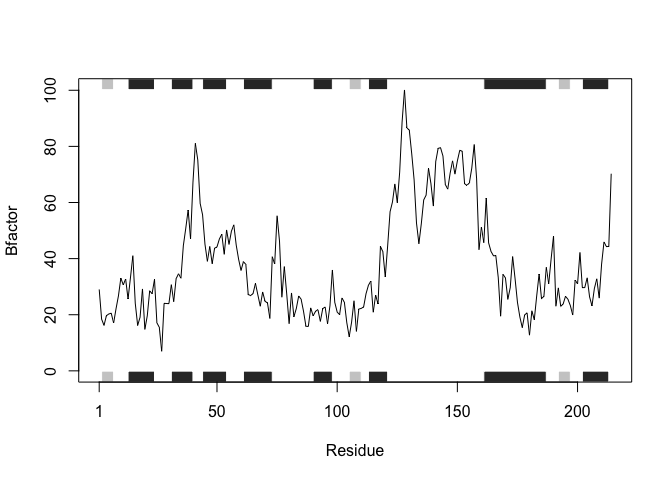

Class\_06
================
Jiaye Chen
January 24, 2019

Section 1: Reading files again :-)
----------------------------------

Here we are going to try using the **read.table()** function and friends to read some example flat files.

``` r
plot(1:10)
```


Back to file reading...

``` r
File1 <- ("https://bioboot.github.io/bimm143_W19/class-material/test1.txt")
data1 <- read.csv(File1)
data1
```

    ##   Col1 Col2 Col3
    ## 1    1    2    3
    ## 2    4    5    6
    ## 3    7    8    9
    ## 4    a    b    c

Reading text2

``` r
File2 <- ("https://bioboot.github.io/bimm143_W19/class-material/test2.txt")
data2 <- read.csv(File2, sep = "$")
data2
```

    ##   Col1 Col2 Col3
    ## 1    1    2    3
    ## 2    4    5    6
    ## 3    7    8    9
    ## 4    a    b    c

Reading text3

``` r
File3 <- ("https://bioboot.github.io/bimm143_W19/class-material/test3.txt")
data3 <- read.table(File3, header = FALSE)
data3
```

    ##   V1 V2 V3
    ## 1  1  6  a
    ## 2  2  7  b
    ## 3  3  8  c
    ## 4  4  9  d
    ## 5  5 10  e

Section 2. R Functions
----------------------

My first silly function

``` r
add <- function(x, y = 1) {
  # Sum the input x and y
  x+y
}
```

Lets try using this function

``` r
add(1)
```

    ## [1] 2

``` r
add(3,5)
```

    ## [1] 8

``` r
add(c(1,2,3),4)
```

    ## [1] 5 6 7

Function "rescale"

``` r
rescale <- function(x) {
  rng <- range(x)
  (x - rng[1])/(rng[2] - rng[1])
}
```

small test on "rescale" method

``` r
rescale(1:10)
```

    ##  [1] 0.0000000 0.1111111 0.2222222 0.3333333 0.4444444 0.5555556 0.6666667
    ##  [8] 0.7777778 0.8888889 1.0000000

``` r
rescale(1:3)
```

    ## [1] 0.0 0.5 1.0

rescale2 method with *na.rm*

``` r
rescale2 <- function(x) {
  rng <- range(x, na.rm = TRUE)
  (x - rng[1])/(rng[2] - rng[1])
}
```

Test on rescale2 method

``` r
rescale2(c(1,2,NA,4,10))
```

    ## [1] 0.0000000 0.1111111        NA 0.3333333 1.0000000

rescale3 method

``` r
rescale3 <- function(x, na.rm=TRUE, plot=FALSE) {
   if(na.rm) {
     rng <-range(x, na.rm=TRUE)
   } else {
     rng <-range(x)
   }
   print("Hello")
   answer <- (x - rng[1]) / (rng[2] - rng[1])
   return(answer)
   print("is it me you are looking for?")
   if(plot) {
      plot(answer, typ="b", lwd=4)
   }
   print("I can see it in ...")
}
```

Test on rescale3

``` r
rescale3(c(1:6, NA, 10))
```

    ## [1] "Hello"

    ## [1] 0.0000000 0.1111111 0.2222222 0.3333333 0.4444444 0.5555556        NA
    ## [8] 1.0000000

``` r
rescale4 <- function(x, na.rm=TRUE, plot=FALSE) {
    rng <-range(x, na.rm=na.rm)
    print("Hello")
   answer <- (x - rng[1]) / (rng[2] - rng[1])
   print("is it me you are looking for?")
   if(plot) {
      plot(answer, typ="b", lwd=4)
   }
   print("I can see it in ...")
   return(answer)
}
```

``` r
rescale4(c(1:6, NA, 10), plot = TRUE)
```

    ## [1] "Hello"
    ## [1] "is it me you are looking for?"


    ## [1] "I can see it in ..."

    ## [1] 0.0000000 0.1111111 0.2222222 0.3333333 0.4444444 0.5555556        NA
    ## [8] 1.0000000

Hand-on Section
---------------

Question 1B

``` r
library(bio3d)
s1 <- read.pdb("4AKE")  # kinase with drug
```

    ##   Note: Accessing on-line PDB file

``` r
s2 <- read.pdb("1AKE")  # kinase no drug
```

    ##   Note: Accessing on-line PDB file
    ##    PDB has ALT records, taking A only, rm.alt=TRUE

``` r
s3 <- read.pdb("1E4Y")  # kinase with drug
```

    ##   Note: Accessing on-line PDB file

``` r
s1.chainA <- trim.pdb(s1, chain="A", elety="CA")
s2.chainA <- trim.pdb(s2, chain="A", elety="CA")
s3.chainA <- trim.pdb(s1, chain="A", elety="CA")

s1.b <- s1.chainA$atom$b
s2.b <- s2.chainA$atom$b
s3.b <- s3.chainA$atom$b

plotb3(s1.b, sse=s1.chainA, typ="l", ylab="Bfactor")
```


``` r
plotb3(s2.b, sse=s2.chainA, typ="l", ylab="Bfactor")
```


``` r
plotb3(s3.b, sse=s3.chainA, typ="l", ylab="Bfactor")
```



Improvement of the above code

``` r
Analysis <- function(x){
  s <- read.pdb(x)
  s.chainA <- trim.pdb(s, chain = "A", elety = "CA")
  s.b <- s.chainA$atom$b
  plotb3(s.b, sse=s.chainA, typ="l", ylab = "Bfactor")
}
```

Test on the improvement of Analysis method

``` r
test <- c("4AKE", "1AKE", "1E4Y")
for (i in test){
  Analysis(i)
}
```

    ##   Note: Accessing on-line PDB file

    ## Warning in get.pdb(file, path = tempdir(), verbose = FALSE): /var/folders/
    ## 0k/9dctl_7x39ldfbvgdt7f34400000gn/T//RtmpNQxxVE/4AKE.pdb exists. Skipping
    ## download

    ##   Note: Accessing on-line PDB file

    ## Warning in get.pdb(file, path = tempdir(), verbose = FALSE): /var/folders/
    ## 0k/9dctl_7x39ldfbvgdt7f34400000gn/T//RtmpNQxxVE/1AKE.pdb exists. Skipping
    ## download


    ##    PDB has ALT records, taking A only, rm.alt=TRUE

    ##   Note: Accessing on-line PDB file

    ## Warning in get.pdb(file, path = tempdir(), verbose = FALSE): /var/folders/
    ## 0k/9dctl_7x39ldfbvgdt7f34400000gn/T//RtmpNQxxVE/1E4Y.pdb exists. Skipping
    ## download


