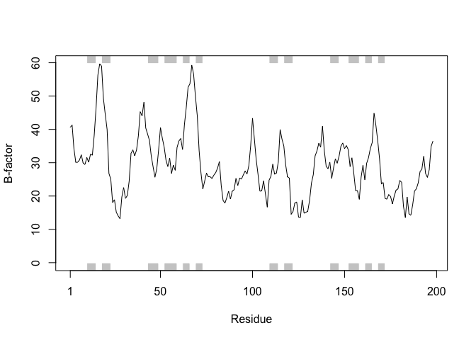

Class11: Structural Bioinformatics
================

Section 1. The PDB
------------------

Q1: Download a CSV file from the PDB site (accessible from “Analyze” -&gt; “PDB Statistics” &gt; “by Experimental Method and Molecular Type”. Move this CSV file into your RStudio project and determine the percentage of structures solved by X-Ray and Electron Microscopy. From the website what proportion of structures are protein? Aim to have a rendered GitHub document with working code that yields your answers.

``` r
stats <- read.csv("Data Export Summary.csv")
show(stats)
```

    ##   Experimental.Method Proteins Nucleic.Acids Protein.NA.Complex Other
    ## 1               X-Ray   124770          1993               6451    10
    ## 2                 NMR    10988          1273                257     8
    ## 3 Electron Microscopy     2057            31                723     0
    ## 4               Other      250             4                  6    13
    ## 5        Multi Method      127             5                  2     1
    ##    Total
    ## 1 133224
    ## 2  12526
    ## 3   2811
    ## 4    273
    ## 5    135

``` r
percent.by.method <- stats$Total/sum(stats$Total)*100
names(percent.by.method) <- stats$Experimental.Method
percent.by.method
```

    ##               X-Ray                 NMR Electron Microscopy 
    ##         89.43068692          8.40846082          1.88696977 
    ##               Other        Multi Method 
    ##          0.18325960          0.09062288

BIO3D
-----

``` r
library(bio3d)
example(plot.bio3d)
```

    ## 
    ## plt.b3> ## No test: 
    ## plt.b3> ##D # PDB server connection required - testing excluded
    ## plt.b3> ##D 
    ## plt.b3> ##D ## Plot of B-factor values along with secondary structure from PDB
    ## plt.b3> ##D pdb <- read.pdb( "1bg2" )
    ## plt.b3> ##D bfac <- pdb$atom[pdb$calpha,"b"]
    ## plt.b3> ##D plot.bio3d(bfac, sse=pdb, ylab="B-factor", col="gray")
    ## plt.b3> ##D points(bfac, typ="l")
    ## plt.b3> ## End(No test)
    ## plt.b3> 
    ## plt.b3> ## Not run: 
    ## plt.b3> ##D ## Use PDB residue numbers and include short secondary structure elements
    ## plt.b3> ##D plot.bio3d(pdb$atom[pdb$calpha,"b"], sse=pdb, resno=pdb, ylab="B-factor",
    ## plt.b3> ##D   typ="l", lwd=1.5, col="blue", sse.min.length=0)
    ## plt.b3> ##D 
    ## plt.b3> ##D 
    ## plt.b3> ##D ## Calculate secondary structure using stride() or dssp()
    ## plt.b3> ##D #sse <- stride(pdb)
    ## plt.b3> ##D sse <- dssp(pdb)
    ## plt.b3> ##D 
    ## plt.b3> ##D ## Plot of B-factor values along with calculated secondary structure
    ## plt.b3> ##D plot.bio3d(pdb$atom[pdb$calpha,"b"], sse=sse, ylab="B-factor", typ="l",
    ## plt.b3> ##D col="blue", lwd=2)
    ## plt.b3> ## End(Not run)
    ## plt.b3> 
    ## plt.b3> ## No test: 
    ## plt.b3> ##D # PDB server connection required - testing excluded
    ## plt.b3> ##D 
    ## plt.b3> ##D ## Plot 'aligned' data respecting gap positions
    ## plt.b3> ##D attach(transducin)
    ## plt.b3> ##D 
    ## plt.b3> ##D pdb = read.pdb("1tnd") ## Reference PDB see: pdbs$id[1]
    ## plt.b3> ##D pdb = trim.pdb(pdb, inds=atom.select(pdb, chain="A"))
    ## plt.b3> ##D 
    ## plt.b3> ##D ## Plot of B-factor values with gaps
    ## plt.b3> ##D plot.bio3d(pdbs$b, resno=pdb, sse=pdb, ylab="B-factor")
    ## plt.b3> ##D 
    ## plt.b3> ##D ## Plot of B-factor values after removing all gaps 
    ## plt.b3> ##D plot.bio3d(pdbs$b, rm.gaps=TRUE, resno = pdb, sse=pdb, ylab="B-factor")
    ## plt.b3> ##D 
    ## plt.b3> ##D detach(transducin)
    ## plt.b3> ## End(No test)
    ## plt.b3> 
    ## plt.b3> ## Fancy secondary structure elements
    ## plt.b3> ##plot.bio3d(pdb$atom[pdb$calpha,"b"], sse=pdb, ssetype="fancy")
    ## plt.b3> ## Currently not implemented
    ## plt.b3> 
    ## plt.b3> 
    ## plt.b3>

``` r
pdb <- read.pdb("1hsg.pdb")
pdb
```

    ## 
    ##  Call:  read.pdb(file = "1hsg.pdb")
    ## 
    ##    Total Models#: 1
    ##      Total Atoms#: 1686,  XYZs#: 5058  Chains#: 2  (values: A B)
    ## 
    ##      Protein Atoms#: 1514  (residues/Calpha atoms#: 198)
    ##      Nucleic acid Atoms#: 0  (residues/phosphate atoms#: 0)
    ## 
    ##      Non-protein/nucleic Atoms#: 172  (residues: 128)
    ##      Non-protein/nucleic resid values: [ HOH (127), MK1 (1) ]
    ## 
    ##    Protein sequence:
    ##       PQITLWQRPLVTIKIGGQLKEALLDTGADDTVLEEMSLPGRWKPKMIGGIGGFIKVRQYD
    ##       QILIEICGHKAIGTVLVGPTPVNIIGRNLLTQIGCTLNFPQITLWQRPLVTIKIGGQLKE
    ##       ALLDTGADDTVLEEMSLPGRWKPKMIGGIGGFIKVRQYDQILIEICGHKAIGTVLVGPTP
    ##       VNIIGRNLLTQIGCTLNF
    ## 
    ## + attr: atom, xyz, seqres, helix, sheet,
    ##         calpha, remark, call

``` r
attributes(pdb)
```

    ## $names
    ## [1] "atom"   "xyz"    "seqres" "helix"  "sheet"  "calpha" "remark" "call"  
    ## 
    ## $class
    ## [1] "pdb" "sse"

``` r
head(pdb$atom)
```

    ##   type eleno elety  alt resid chain resno insert      x      y     z o
    ## 1 ATOM     1     N <NA>   PRO     A     1   <NA> 29.361 39.686 5.862 1
    ## 2 ATOM     2    CA <NA>   PRO     A     1   <NA> 30.307 38.663 5.319 1
    ## 3 ATOM     3     C <NA>   PRO     A     1   <NA> 29.760 38.071 4.022 1
    ## 4 ATOM     4     O <NA>   PRO     A     1   <NA> 28.600 38.302 3.676 1
    ## 5 ATOM     5    CB <NA>   PRO     A     1   <NA> 30.508 37.541 6.342 1
    ## 6 ATOM     6    CG <NA>   PRO     A     1   <NA> 29.296 37.591 7.162 1
    ##       b segid elesy charge
    ## 1 38.10  <NA>     N   <NA>
    ## 2 40.62  <NA>     C   <NA>
    ## 3 42.64  <NA>     C   <NA>
    ## 4 43.40  <NA>     O   <NA>
    ## 5 37.87  <NA>     C   <NA>
    ## 6 38.40  <NA>     C   <NA>

``` r
# Print a subset of $atom data for the first two atoms  
pdb$atom[1:2, c("eleno", "elety", "x","y","z")]
```

    ##   eleno elety      x      y     z
    ## 1     1     N 29.361 39.686 5.862
    ## 2     2    CA 30.307 38.663 5.319

``` r
# Note that individual $atom records can also be accessed like this  
pdb$atom$elety[1:2]
```

    ## [1] "N"  "CA"

``` r
# Which allows us to do the following  
plot.bio3d(pdb$atom$b[pdb$calpha], sse=pdb, typ="l", ylab ="B-factor")
```



``` r
# Print a summary of the coordinate data in $xyz
pdb$xyz
```

    ## 
    ##    Total Frames#: 1
    ##    Total XYZs#:   5058,  (Atoms#:  1686)
    ## 
    ##     [1]  29.361  39.686  5.862  <...>  30.112  17.912  -4.791  [5058] 
    ## 
    ## + attr: Matrix DIM = 1 x 5058

``` r
# Select all C-alpha atoms (return their indices)  
ca.inds <- atom.select(pdb, "calpha") 
ca.inds
```

    ## 
    ##  Call:  atom.select.pdb(pdb = pdb, string = "calpha")
    ## 
    ##    Atom Indices#: 198  ($atom)
    ##    XYZ  Indices#: 594  ($xyz)
    ## 
    ## + attr: atom, xyz, call

Write new PDB file
------------------

we want to select out the protein and drug only parts of these molecular PDB files

``` r
prot.inds <- atom.select(pdb,"protein")
#pdb$atom[prot.inds$atom]
#write.pdb("1hsg.pdb","ProtOnly.pdb", )
```

``` r
prot.pdb <- trim.pdb(pdb, prot.inds)
write.pdb(prot.pdb, file = "protein.pdb")
```

Lets do the same thing for our drug

``` r
lig.inds <- atom.select(pdb,"ligand") 
lig.pdb <- trim.pdb(pdb, lig.inds)
write.pdb(lig.pdb, file = "ligand.pdb")
```
