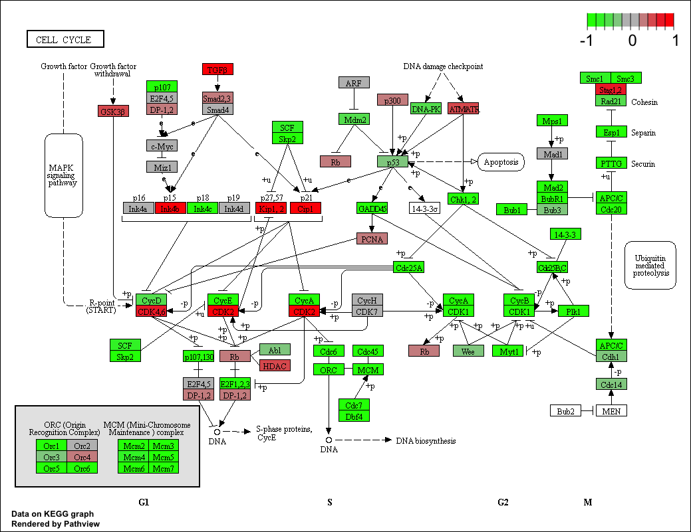

```{r setup, include=FALSE}
knitr::opts_chunk$set(echo = TRUE)
```

##  Differential Expression Analysis

```{r deseq_load, message=FALSE}
library(DESeq2)
```

```{r}
#My input files for today's class
metaFile <- "GSE37704_metadata.csv"
countFile <- "GSE37704_featurecounts.csv"
```
```{r}
# Import metadata and take a peak
colData = read.csv(metaFile, row.names=1)
head(colData)
```
```{r}
# Import countdata
countData = read.csv(countFile, row.names=1)
head(countData)
```

Q1:Complete the code below to remove the troublesome first column from countData
```{r}
# Note we need to remove the odd first $length col
countData <- as.matrix(countData[,-1])
head(countData)

```
```{r}
dim(countData)
```
```{r}
rownames(colData)
colnames(countData)
```
```{r}
all(rownames(colData) == colnames(countData))
```

Q2: Complete the code below to filter countData to exclude genes (i.e. rows) where we have 0 read count across all samples (i.e. columns).

```{r}
# Filter count data where you have 0 read count across all samples.
gene_none_0_count <- rowSums(countData) != 0
countData = countData[gene_none_0_count, ]
head(countData)
```
```{r}
sum(gene_0_count)
dim(countData)
```

### Running DESeq2
```{r}
dds = DESeqDataSetFromMatrix(countData=countData,
                             colData=colData,
                             design=~condition)
dds = DESeq(dds)
```

```{r}
dds
```

```{r}
res = results(dds, contrast=c("condition", "hoxa1_kd", "control_sirna"))
```

```{r}
summary(res)
```

### Volcano Plot
```{r}
plot( res$log2FoldChange, -log(res$padj) )
```

Q. Improve this plot by completing the below code, which adds color and axis labels
```{r}
# Make a color vector for all genes
mycols <- rep("gray", nrow(res) )

# Color red the genes with absolute fold change above 2
mycols[ abs(res$log2FoldChange) > 2 ] <- "red"

# Color blue those with adjusted p-value less than 0.01
#  and absolute fold change more than 2
inds <- (res$padj < 0.01) & (abs(res$log2FoldChange) > 2 )
mycols[ inds ] <- "blue"

plot( res$log2FoldChange, -log(res$padj), col= mycols, xlab="Log2(FoldChange)", ylab="-Log(P-value)" )
```

### Adding gene annotation
```{r eval=FALSE}
source("http://bioconductor.org/biocLite.R")
biocLite("AnnotationDbin")
biocLite("org.Hs.eg.db")
```

Q. Use the mapIDs() function multiple times to add SYMBOL, ENTREZID and GENENAME annotation to our results by completing the code below.
```{r}
library("AnnotationDbi")
library("org.Hs.eg.db")

columns(org.Hs.eg.db)
```

```{r}
res$symbol = mapIds(org.Hs.eg.db,
                    keys=row.names(res), 
                    keytype="ENSEMBL",
                    column="SYMBOL",
                    multiVals="first")

res$entrez = mapIds(org.Hs.eg.db,
                    keys=row.names(res),
                    keytype="ENSEMBL",
                    column="ENTREZID",
                    multiVals="first")

res$name =   mapIds(org.Hs.eg.db,
                    keys=row.names(res),
                    keytype="ENSEMBL",
                    column="GENENAME",
                    multiVals="first")
```

```{r}
head(res, 10)
```

Q. Finally for this section let’s reorder these results by adjusted p-value and save them to a CSV file in your current project directory.

```{r}
res = res[order(res$pvalue),]
write.csv(res, file ="deseq_results.csv")
```

## Pathway Analysis

### KEGG pathways
First we need to do our one time install of these required bioconductor packages:
```{r eval=FALSE}
source("http://bioconductor.org/biocLite.R")
biocLite( c("pathview", "gage", "gageData") )
```

Now we can load the packages and setup the KEGG data-sets we need.
```{r}
library(pathview)
```

```{r}
library(gage)
library(gageData)

data(kegg.sets.hs)
data(sigmet.idx.hs)

# Focus on signaling and metabolic pathways only
kegg.sets.hs = kegg.sets.hs[sigmet.idx.hs]

# Examine the first 3 pathways
head(kegg.sets.hs, 3)
```

The main gage() function requires a named vector of fold changes, where the names of the values are the Entrez gene IDs.

Note that we used the mapIDs() function above to obtain Entrez gene IDs (stored in res$entrez) and we have the fold change results from DESeq2 analysis (stored in res$log2FoldChange).

```{r}
foldchanges = res$log2FoldChange
names(foldchanges) = res$entrez
head(foldchanges)
```

```{r}
# Get the result
keggres = gage(foldchanges, gsets = kegg.sets.hs)
```

```{r}
attributes(keggres)
```

```{r}
# Look at the first few down (less) pathways
head(keggres$less)
```

Now, let’s try out the pathview() function from the pathview package to make a pathway plot with our RNA-Seq expression results shown in color.
To begin with lets manually supply a pathway.id (namely the first part of the "hsa04110 Cell cycle") that we could see from the print out above.
```{r}
pathview(gene.data=foldchanges, pathway.id="hsa04110")
```


```{r}
# A different PDF based output of the same data
pathview(gene.data=foldchanges, pathway.id="hsa04110", kegg.native=FALSE)
```

Now, let’s process our results a bit more to automagicaly pull out the top 5 upregulated pathways, then further process that just to get the pathway IDs needed by the pathview() function. We’ll use these KEGG pathway IDs for pathview plotting below.
```{r}
## Focus on top 5 upregulated pathways here for demo purposes only
keggrespathways <- rownames(keggres$greater)[1:5]

# Extract the 8 character long IDs part of each string
keggresids = substr(keggrespathways, start=1, stop=8)
keggresids
```

Finally, lets pass these IDs in keggresids to the pathview() function to draw plots for all the top 5 pathways.
```{r}
pathview(gene.data=foldchanges, pathway.id=keggresids, species="hsa")
```

Q. Can you do the same procedure as above to plot the pathview figures for the top 5 down-reguled pathways?
```{r}
# Focus on top 5 downregualted pathways here 
keggres_down_reg_pathways <- rownames(keggres$less)[1:5]

# Extract the 8 character long IDs part of wach string
keggres_down_reg_pathways_ids = substr(keggres_down_reg_pathways, start = 1, stop = 8)
keggres_down_reg_pathways_ids
```

```{r}
pathview(gene.data=foldchanges, pathway.id=keggres_down_reg_pathways_ids, species="hsa")
```

